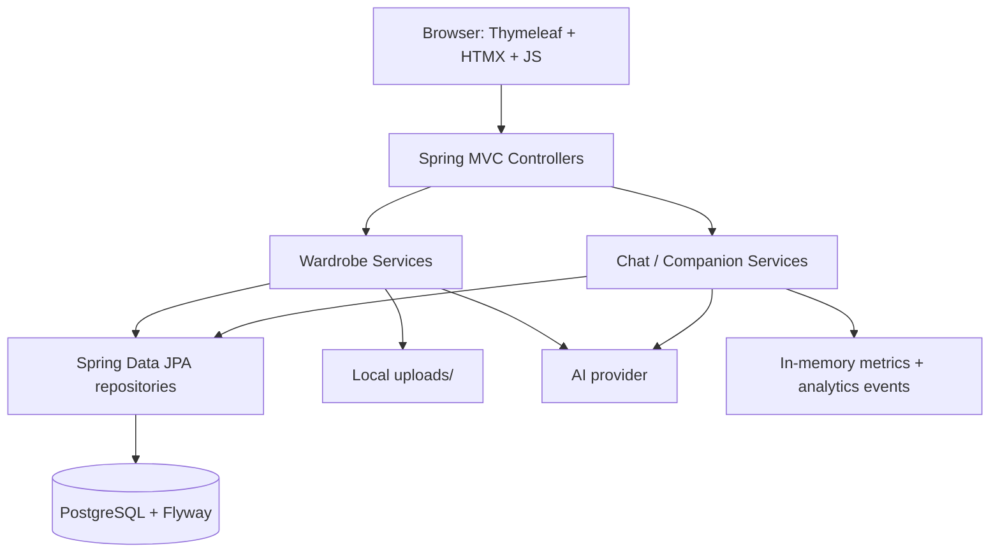
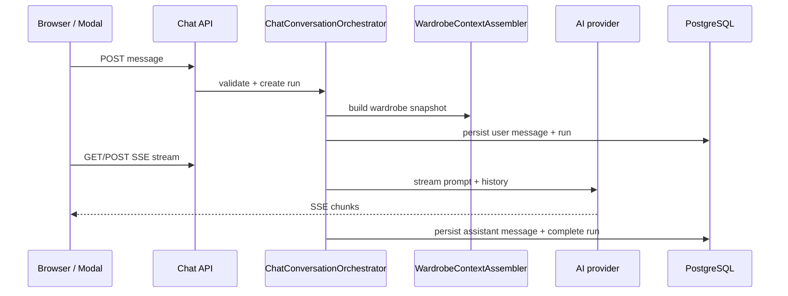

# Armario Cápsula

Armario Cápsula es una aplicación web local para gestionar prendas, clasificar imágenes con IA, planificar outfits semanales y consultar un asistente conversacional de moda. Está pensada como una app **single-user / single-household**, sin login tradicional, con aislamiento por navegador mediante un token anónimo seguro.

## Qué permite hacer

- Subir fotos de prendas en JPG, PNG o WebP.
- Clasificar tipo y color con un proveedor IA OpenAI-compatible.
- Revisar y corregir la clasificación antes de guardar.
- Organizar el guardarropa por categoría, color, favoritos y detalle de prenda.
- Calcular compatibilidad entre prendas con reglas de colorimetría.
- Planificar looks por día de la semana.
- Pedir recomendaciones de outfits al modelo configurado.
- Usar **Colorín Companion**, un asistente modal con historial, feedback y streaming SSE.
- Consultar métricas operativas protegidas por token admin.

## Stack técnico

| Capa | Tecnología |
|---|---|
| Lenguaje | Java 21 |
| Framework | Spring Boot 3.5.14 |
| Build | Maven |
| UI | Thymeleaf server-side + HTMX + JavaScript modular |
| Base de datos | PostgreSQL 16 Alpine en desarrollo |
| Migraciones | Flyway |
| Seguridad | Spring Security 6: CSRF + headers + token admin, sin login |
| IA | WebClient reactivo contra API OpenAI-compatible |
| Streaming | SSE con `SseEmitter` |
| Imágenes | Thumbnailator + TwelveMonkeys WebP |
| Caché / rate limit | Caffeine |
| Tests | JUnit 5, Mockito, MockMvc, WireMock, H2 |
| Observabilidad | Actuator + logs estructurables con Logstash encoder |

## Inicio rápido

### 1. Requisitos

- Java 21+
- Maven
- Docker Desktop o Docker Engine

### 2. Levantar PostgreSQL

```bash
docker compose up -d postgres
```

La base local queda en `localhost:55432` para evitar conflictos con un PostgreSQL local en `5432`.

### 3. Configurar entorno

Usá `.env.example` como referencia. Docker Compose lee `.env` automáticamente para PostgreSQL; Spring Boot no lo carga por sí solo, así que exportá las variables en la terminal o configuralas en tu IDE.

```bash
export DB_PASSWORD=ropa
export NAN_API_KEY=replace-with-your-provider-key
# Opcional para trabajar sin IA externa:
export APP_AI_ENABLED=false
```

### 4. Ejecutar

```bash
mvn spring-boot:run
```

Abrí: <http://localhost:8081>

### 5. Validar

```bash
mvn test
```

La suite usa H2 en memoria y no toca PostgreSQL local.

## Arquitectura en una mirada



La app es un monolito MVC modular. No expone una SPA ni una API pública general: las vistas principales son server-side y los endpoints REST/SSE existen para chat, companion, métricas y fragmentos dinámicos.

### Responsabilidades principales

| Área | Componentes | Rol |
|---|---|---|
| Guardarropa | `GarmentController`, `GarmentService`, `GarmentRepository` | CRUD de prendas, filtros, favoritos y dashboard |
| Subidas | `ImageStorageService`, `LocalImageStorageService` | Validación, redimensionado y almacenamiento local de imágenes |
| IA de prendas | `AiClassificationService`, `AiRecommendationService` | Clasificación de imagen y recomendaciones de outfits |
| Colorimetría | `ColorSeasonClassifier`, `ColorCompatibilityEngine`, `ColorPaletteStore` | Temporada cromática, compatibilidad y explicaciones |
| Plan semanal | `WeekPlanService`, `WeekPlanRepository` | Asignación, reemplazo, orden y eliminación de prendas por día |
| Chat legacy | `FashionChatController`, `ChatApiController` | Página `/chat`, sesiones, mensajes, feedback y streaming |
| Colorín Companion | `CompanionChatApiController`, `CompanionTipService`, JS companion | Modal global con contexto de armario y SSE |
| Ownership | `AnonymousOwnerService`, `CurrentOwnerFilter` | Aislamiento por navegador usando cookie `owner_token` |
| Observabilidad | `ChatMetricsService`, `ChatAnalyticsService`, `ChatDataRetentionService` | Métricas, eventos, retention y limpieza programada |
| Seguridad | `SecurityConfig`, `RateLimitingInterceptor`, exception handlers | CSRF, headers, admin token, rate limits y errores seguros |

## Flujo funcional

### Alta de prenda

1. La usuaria abre `/wardrobe/new`.
2. Sube una imagen válida.
3. La app valida tamaño, tipo MIME y magic bytes.
4. La imagen se redimensiona y se guarda en `uploads/`.
5. Si `app.ai.enabled=true`, se envía al proveedor IA.
6. La pantalla de confirmación permite corregir nombre, categoría, color, material y temporada.
7. `GarmentService` valida y normaliza el formulario antes de persistir.
8. La prenda queda disponible en dashboard, guardarropa, detalle, recomendaciones y plan semanal.

Si la IA falla, el flujo no queda bloqueado: la prenda puede completarse manualmente.

### Recomendaciones y colorimetría

- `AiRecommendationService` arma un prompt con datos del armario marcados como **datos no confiables** para reducir riesgo de prompt injection.
- `ColorSeasonClassifier` calcula perfiles en CIELAB a partir de `colorHex`.
- `ColorCompatibilityEngine` combina distancia ΔE00, estación cromática y reglas de armonía.
- La temporada cromática se calcula al vuelo; no se guarda en base de datos.

### Chat y Colorín Companion



El chat tiene dos superficies aisladas:

| Superficie | UI | API |
|---|---|---|
| Chat legacy | `/chat` | `/api/chat/**` |
| Colorín Companion | Modal global | `/api/companion/**` |

La columna `chat_sessions.surface` evita mezclar historial entre ambas experiencias.

## Seguridad

| Riesgo | Mitigación actual |
|---|---|
| CSRF | CSRF habilitado; tokens en metatags para HTMX y hidden inputs en formularios normales |
| Login innecesario | No hay login ni HTTP Basic; se excluye el usuario generado por Spring Boot |
| Acceso admin | `/api/admin/**` y `/admin/**` requieren `X-Admin-Token`; sin token configurado quedan cerrados |
| Toma de owner | Cookie opaca `owner_token`; el servidor guarda solo SHA-256 en `anonymous_owners.token_hash` |
| Cookies inseguras | `HttpOnly`, `SameSite=Lax`, `Secure` cuando la petición llega por HTTPS / `X-Forwarded-Proto=https` |
| Upload malicioso | Tamaño máximo, MIME permitido, magic bytes y conversión controlada a JPEG |
| Path traversal | Las rutas de imagen se normalizan y deben colgar de `/uploads/` |
| Filtrado de información | `SecurityException` devuelve mensajes genéricos en MVC y REST |
| Payloads incompletos | APIs REST validan cuerpo nulo, campos obligatorios y tamaños máximos antes de llamar a servicios |
| Flooding | Rate limits por endpoint/IP y por owner con Caffeine |
| Prompt injection | Datos del armario delimitados como no confiables en prompts de recomendación |
| Schema drift | `spring.jpa.hibernate.ddl-auto=validate`; Flyway gobierna el esquema |

### Headers de seguridad

`SecurityConfig` define CSP, referrer policy, permissions policy y `X-Frame-Options: DENY`. La CSP permite scripts propios, HTMX desde `unpkg.com`, fuentes de Google y placeholders de imagen configurados.

## Modelo de datos

| Entidad | Propósito |
|---|---|
| `Garment` | Prenda guardada, clasificación IA, color, categoría, imagen y favoritos |
| `WeekPlan` | Asignación ordenada de prendas a días de la semana |
| `AnonymousOwner` | Owner anónimo por navegador, identificado por hash del token opaco |
| `ChatSession` | Sesión de chat por owner y superficie (`MAIN_CHAT` o `COMPANION`) |
| `ChatMessage` | Mensajes de usuario/asistente, vinculables a `ChatRun` |
| `ChatRun` | Ejecución de IA: modelo pedido/resuelto, estado, tokens y errores |
| `ChatFeedback` | Valoración de respuestas (`up` / `down`) con comentario opcional |
| `ChatAnalyticsEvent` | Eventos JSON para métricas históricas y retention |

### Migraciones Flyway

Las migraciones viven en `src/main/resources/db/migration/`.

| Rango | Contenido |
|---|---|
| `V1`-`V4` | Prendas, favoritos, plan semanal y seed no-op seguro |
| `V5`-`V10` | Owners anónimos y tablas base de chat con surface isolation |
| `V13`-`V16` | Índices y enlace de feedback a mensajes |
| `V17` | `token_hash` para owners anónimos |
| `V18` | Ordering seguro de plan semanal con constraint diferible |
| `V19` | Relación `chat_messages.run_id` |
| `V20` | Elimina default DB de `chat_sessions.model`; el backend resuelve modelo con `ModelRouter` |

> Nota de mantenimiento: `V4__seed_test_data.sql` es intencionalmente no-op. Los datos demo se crean desde `/wardrobe/seed` y solo si el guardarropa está vacío.

## Rutas principales

### Vistas y acciones de guardarropa

| Método | Ruta | Respuesta | Descripción |
|---|---|---|---|
| GET | `/` | Redirect | Redirige a `/dashboard` |
| GET | `/dashboard` | `dashboard` | Estadísticas, últimas prendas y progreso semanal |
| GET | `/wardrobe` | `wardrobe` | Grid completo |
| GET | `/wardrobe/filter` | `wardrobe :: grid` | Filtro HTMX por categoría o `favoritos` |
| GET | `/wardrobe/new` | `garment-new` | Formulario de subida |
| POST | `/wardrobe/analyze` | `garment-confirm` | Guarda imagen y clasifica con IA |
| POST | `/wardrobe` | Redirect | Crea prenda confirmada |
| GET | `/wardrobe/{id}` | `garment-detail` | Detalle, compatibles y season badge |
| GET | `/wardrobe/{id}/edit` | `garment-edit` | Formulario de edición |
| PUT | `/wardrobe/{id}` | Redirect o vista con errores | Actualiza datos editables |
| DELETE | `/wardrobe/{id}` | Body vacío / `HX-Redirect` | Elimina prenda |
| POST | `/wardrobe/{id}/favorite` | Fragmento HTMX | Alterna favorito |
| POST | `/wardrobe/seed` | Redirect | Crea datos demo si no hay prendas |
| GET | `/inspiration` | `inspiration` | Looks predefinidos |
| GET | `/recommendation` | `recommendation` | Outfits recomendados por IA |
| GET | `/weekly-plan` | `weekly-plan` | Plan semanal |
| POST | `/weekly-plan/assign` | Body vacío | Asigna prenda a día/posición |
| PUT | `/weekly-plan/reorder` | Body vacío | Reordena un día |
| DELETE | `/weekly-plan/{id}` | Body vacío | Quita una asignación |
| GET | `/profile` | `profile-stats` | Estadísticas detalladas |

### Chat legacy `/api/chat`

| Método | Ruta | Descripción |
|---|---|---|
| POST | `/api/chat/sessions` | Crear sesión |
| GET | `/api/chat/sessions` | Listar sesiones |
| PATCH | `/api/chat/sessions/{id}/title` | Renombrar sesión |
| DELETE | `/api/chat/sessions/{sessionId}` | Eliminar sesión |
| GET | `/api/chat/sessions/{sessionId}/messages` | Listar mensajes |
| POST | `/api/chat/sessions/{sessionId}/messages` | Crear mensaje y run |
| GET | `/api/chat/stream/{runId}` | Streaming SSE del run |
| POST | `/api/chat/messages/{messageId}/feedback` | Feedback por mensaje |
| GET | `/api/chat/models` | Modelos disponibles |

### Colorín Companion `/api/companion`

| Método | Ruta | Descripción |
|---|---|---|
| GET | `/api/companion/context` | Contexto y tips |
| GET | `/api/companion/tips` | Alias de tips |
| POST | `/api/companion/sessions` | Crear sesión |
| GET | `/api/companion/sessions` | Listar sesiones |
| PATCH | `/api/companion/sessions/{sessionId}` | Renombrar sesión |
| DELETE | `/api/companion/sessions/{sessionId}` | Eliminar sesión |
| GET | `/api/companion/sessions/{sessionId}/messages` | Listar mensajes |
| POST | `/api/companion/sessions/{sessionId}/messages` | Enviar mensaje |
| GET | `/api/companion/stream/{runId}` | Streaming SSE |
| POST | `/api/companion/messages/{messageId}/feedback` | Feedback compatible |
| POST | `/api/companion/sessions/{sessionId}/messages/{messageId}/feedback` | Feedback validando sesión |

### Admin y health

| Método | Ruta | Protección | Descripción |
|---|---|---|---|
| GET | `/api/admin/metrics` | `X-Admin-Token` | Métricas live de chat |
| GET | `/api/admin/metrics/history?days=14` | `X-Admin-Token` | Métricas históricas agregadas |
| GET | `/admin/chat-metrics` | `X-Admin-Token` | Vista HTML de métricas |
| GET | `/actuator/health` | Público | Health agregado |
| GET | `/actuator/health/liveness` | Público | Liveness probe |
| GET | `/actuator/health/readiness` | Público | Readiness probe |

## Configuración

### Variables recomendadas

| Variable | Requerida | Descripción |
|---|---:|---|
| `DB_PASSWORD` | Sí en local si no usás el default | Password de PostgreSQL |
| `NAN_API_KEY` | Sí si `APP_AI_ENABLED=true` | API key del proveedor IA preferido |
| `APP_AI_API_KEY` | Alternativa | Alias compatible para API key |
| `APP_AI_ENABLED` | No | `false` permite desarrollar sin proveedor IA |
| `ADMIN_TOKEN` | Recomendado | Token para endpoints admin; vacío los deja cerrados |

### Propiedades principales

| Propiedad | Default | Descripción |
|---|---|---|
| `server.port` | `8081` | Puerto local |
| `spring.datasource.url` | `jdbc:postgresql://localhost:55432/ropa` | DB de desarrollo |
| `spring.jpa.hibernate.ddl-auto` | `validate` | Hibernate valida; no migra |
| `spring.flyway.enabled` | `true` | Flyway aplica migraciones |
| `spring.jpa.open-in-view` | `false` | Transacciones explícitas |
| `app.ai.enabled` | `${APP_AI_ENABLED:true}` | Activa llamadas IA |
| `app.ai.base-url` | `https://api.nan.builders` | Proveedor OpenAI-compatible |
| `app.ai.chat-path` | `/v1/chat/completions` | Endpoint de chat |
| `app.ai.model` | `qwen3.6` | Modelo por defecto |
| `app.upload.directory` | `uploads` | Directorio local de imágenes |
| `app.upload.max-size` | `8MB` | Límite por archivo |
| `app.admin.token` | vacío | Token admin opcional |

### Modelos IA configurados

| ID | Nombre | Provider | Default |
|---|---|---|---|
| `gemma4` | Gemma 4 | Google | No |
| `qwen3.6` | Qwen 3.6 | Alibaba | Sí |
| `deepseek-v4-flash` | DeepSeek V4 Flash | DeepSeek | No |

## Rate limits

| Flujo | Límite | Ventana | Ámbito |
|---|---:|---:|---|
| `POST /wardrobe/analyze` | 10 | 60 min | IP |
| `GET /recommendation` | 5 | 30 min | IP |
| Chat SSE global | 30 | 1 min | IP |
| Chat mensajes/feedback | 10 | 1 min | Owner |
| Policy engine interno | 30 | 1 min | Owner |

Los errores se devuelven como vista amigable en MVC o `ProblemDetail` / `ErrorResponse` en APIs REST.

## Testing y calidad

### Comandos habituales

```bash
# Suite completa
mvn test

# Un test concreto
mvn test -Dtest=GarmentServiceTest

# Construcción completa
mvn clean install
```

### Perfil de test

`src/test/resources/application-test.yml` fuerza:

- H2 en memoria: `jdbc:h2:mem:testdb`
- Flyway desactivado
- `ddl-auto=create-drop`
- Rate limits altos para evitar falsos positivos

### Cobertura actual

La suite actual cubre controladores MVC, REST/SSE de chat, servicios, repositorios H2, WireMock contra proveedor IA, seguridad CSRF/admin token, colorimetría, subida de imágenes, retention y métricas.

Validación reciente del baseline de hardening:

```text
mvn test
Tests run: 494, Failures: 0, Errors: 0, Skipped: 0
```

También se validó el árbol runtime con OSV:

```text
queried: 123
vulnerable_packages: 0
```

> OWASP Dependency-Check requiere acceso estable a NVD o API key. Sin API key puede fallar por HTTP 429 aunque OSV esté limpio.

## Operación y mantenimiento

### Datos demo

Usá `POST /wardrobe/seed` desde la UI o una petición autenticada con CSRF. El seed solo actúa si el guardarropa está vacío.

### Retención

`ChatDataRetentionService` ejecuta limpieza diaria:

- borra eventos de analytics más antiguos que `app.chat.retention.analytics-events-days`;
- archiva sesiones inactivas más antiguas que `app.chat.retention.session-inactive-days`;
- opcionalmente elimina uploads huérfanos si `orphan-upload-cleanup=true`.

### Documentación como parte del cambio

Cada cambio funcional, de seguridad, configuración, dependencia o flujo de usuario debe actualizar la documentación en el mismo PR. Como mínimo, revisá:

- `README.md` para comportamiento, setup, rutas, seguridad y validación;
- `.env.example` si cambia alguna variable;
- `AGENTS.md` si cambia una convención técnica que futuros agentes deban respetar.

## Solución de problemas

| Problema | Causa probable | Solución |
|---|---|---|
| `Connection refused: localhost:55432` | PostgreSQL no está levantado | `docker compose up -d postgres` y esperar el healthcheck |
| `password authentication failed for user "ropa"` | `DB_PASSWORD` de la app no coincide con la contraseña inicial del volumen PostgreSQL | Usar el mismo `DB_PASSWORD` para `docker compose` y Spring. Si cambiaste la contraseña después de crear el volumen, recreá solo la DB local conscientemente. |
| `Migration checksum mismatch for migration version 4` | La DB local tenía aplicada la antigua V4 con seed destructivo | En DB de desarrollo, decidir entre `flyway:repair` para conservar datos o recrear la DB. No reparar producción sin revisión. |
| `NAN_API_KEY or APP_AI_API_KEY is required` | IA activa sin API key | Exportar `NAN_API_KEY` o usar `APP_AI_ENABLED=false` |
| 403 en admin | Falta `X-Admin-Token` o `ADMIN_TOKEN` no está configurado | Configurar `ADMIN_TOKEN` y enviar el header |
| 429 Too Many Requests | Rate limit agotado | Esperar la ventana o ajustar `app.rate-limit.*` en desarrollo |
| `Title is required` | Renombrado de chat sin body JSON válido o sin `title` | Enviar `{ "title": "Nuevo título" }` |
| La imagen no sube | Formato/tamaño inválido | Usar JPG, PNG o WebP de menos de 8 MB |
| Error de imagen inválida | Magic bytes no coinciden con MIME | Reexportar la imagen con formato real correcto |
| El chat no stremea | Provider IA inaccesible, timeout o API key inválida | Revisar `NAN_API_KEY`, `app.ai.base-url` y `app.ai.read-timeout` |
| No aparecen prendas de otro navegador | Owner isolation por cookie | Es esperado: cada navegador tiene su propio `owner_token` |
| Mockito self-attach falla en JDK moderno | Attach dinámico bloqueado | Surefire ya carga Mockito como `-javaagent`; ejecutar vía `mvn test` |

## Estructura del repositorio

```text
.
├── docker-compose.yml                 # PostgreSQL local
├── pom.xml                            # Build Maven y dependencias
├── src/main/java/com/colorinchi/app
│   ├── config                         # Seguridad, properties, WebClient, MVC, async, health
│   ├── controller                     # MVC, REST/SSE, companion y admin
│   ├── colorimetry                    # Motor de color y compatibilidad
│   ├── dto                            # Formularios y respuestas
│   ├── model                          # Entidades JPA
│   ├── repository                     # Repositorios Spring Data
│   ├── service                        # Casos de uso y orquestación
│   └── upload                         # Almacenamiento local de imágenes
├── src/main/resources
│   ├── application.yml                # Configuración principal
│   ├── db/migration                   # Migraciones Flyway
│   ├── static                         # CSS, JS e imágenes estáticas
│   └── templates                      # Vistas Thymeleaf y fragmentos
└── src/test                           # Tests unitarios, MVC, integración H2 y WireMock
```

## Decisiones importantes

- **Sin autenticación tradicional**: el producto es local/single-user; se usa owner anónimo por cookie para aislamiento práctico.
- **Flyway manda sobre el esquema**: Hibernate solo valida para evitar cambios accidentales de estructura.
- **H2 en tests**: rápido, determinista y evita tocar PostgreSQL compartido.
- **Caffeine para rate limiting**: suficiente para una app local sin sumar infraestructura externa.
- **HTMX + Thymeleaf**: conserva server-side rendering y reduce complejidad frontend.
- **Streaming SSE**: permite respuestas progresivas sin convertir la app en SPA.
- **Datos de armario como no confiables en prompts**: reduce el impacto de texto malicioso guardado por usuarios.
